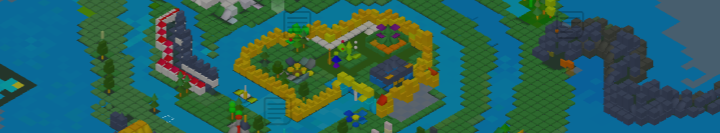

# Nimiq Space

<p align="center">
  
</p>

Open multiplayer isometric hangout for the [Nimiq](https://nimiq.com) community.

Walk a shared grid, chat, build, portal between rooms, and paint the canvas leaderboard. Sign in with a **Nimiq wallet** (or **dev login** locally).

**[Play live →](https://nimiq.space)** · Repo package: `nspace` · [MIT License](LICENSE)

---

### Last 30 days

_Snapshot from production analytics (UTC window ending 2026-07-31)._

| Metric | Value |
|--------|------:|
| Unique visitors | **253** |
| First-time sign-ins | **141** |
| Nimiq Pay unique | **101** (40% of visitors) |
| Other unique (non-Pay) | **152** (60% of visitors) |
| Pay first-time / returning | **75** / **26** |
| Active play (AFK-capped) | **1,120h** |
| NIM paid out | **202,630** |
| NIM to Pay cohort | **41,672** |

Top chosen countries (flag identity, not location): **TR** 11 · **CO** 10 · **AR** 8 · **IN** 7 · **DE** / **IR** / **NL** 6 each.

---

## About

<p>
  
</p>

**Builder** · [`NQ97 4M1T 4TGD VC7F LHLQ Y2DY 425N 5CVH M02Y`](https://nimiq.space)

<br clear="all" />

### Builder story

I grew up on internet forums. The ability to communicate with others around the world over a common subject has been lost. I kind of miss this.

Chat apps like Telegram and Discord miss the mark, as it feels impersonal. Non-English speaking users are confined to their own single-language-only channels, and there is rarely any cross communication between them.

Nimiq Space fits a niche where users can see each other occupying a shared (Nimiq) space, indicating to others that "I'm here right now," which is encouraging for real-life asynchronous communication. Accessibility features were implemented to allow for quick translating between languages.

Nimiq here is the common connection. Any active users silently share this connection and can quickly socialize with others. There's a long way to go, but we've only just planted the seeds :)

---

## Run locally

**Needs:** [Node.js 20+](https://nodejs.org/) (LTS) and npm.

```bash
git clone https://github.com/Harlski/nspace.git
cd nspace
npm install
cp server/.env.example server/.env
```

Enable **Dev login** on the client:

```bash
# client/.env.development
VITE_DEV_AUTH_BYPASS=1
```

(`server/.env` from the example already sets `DEV_AUTH_BYPASS=1` and a local `JWT_SECRET` — do not use those in production.)

```bash
npm run dev
```

Open [http://localhost:5173](http://localhost:5173) → **Dev login**. Client **5173**, server **3001**.

Wallet sign-in: turn bypass off and use **Connect wallet** via [Nimiq Hub](https://hub.nimiq.com).

### Troubleshooting

| Symptom | Check |
|---------|--------|
| Server exits on start | `server/.env` exists with `JWT_SECRET` |
| No Dev login button | `DEV_AUTH_BYPASS=1` + `VITE_DEV_AUTH_BYPASS=1`; restart `npm run dev` |
| Page loads, no connect | Server listening on **3001**; ports free |
| Phone / LAN | Vite **Network** URL; firewall **5173** + **3001** |

Full setup, controls, Docker: **[docs/getting-started.md](docs/getting-started.md)**.

---

## Repo map

| Path | Role |
|------|------|
| `client/` | Vite · TypeScript · Three.js |
| `server/` | Express · WebSocket · room authority |
| `docs/` | Architecture, deploy, process |

Start at **[docs/README.md](docs/README.md)**. Contributing: **[docs/CONTRIBUTING.md](docs/CONTRIBUTING.md)** · agent map: **[AGENTS.md](AGENTS.md)**.

## License

Nimiq Space is available under the [MIT License](LICENSE).
