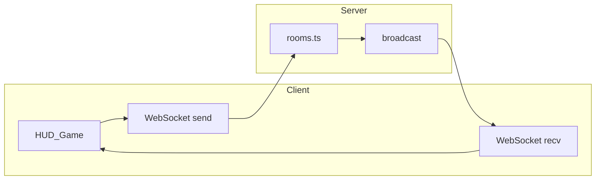

# Build overview

Concise description of how nspace is put together today.

## Stack

- **Monorepo**: npm workspaces — `client` (Vite, TypeScript, Three.js), `server` (Express, `ws`, TypeScript).
- **Auth**: Nimiq wallet message signing + JWT session; optional dev bypass for local work ([server/src/auth.ts](../server/src/auth.ts), [server/src/verifyNimiq.ts](../server/src/verifyNimiq.ts)).
- **Identity visuals**: `@nimiq/identicons` on the client for avatar spheres ([client/src/game/identiconTexture.ts](../client/src/game/identiconTexture.ts)).

## Runtime shape

- **HTTP**: Express on `PORT` (default `3001`) — e.g. `/api/health`, `/api/auth/nonce`, `/api/auth/verify`, `/api/admin/random-layout` ([server/src/index.ts](../server/src/index.ts)).
- **WebSocket**: Path `/ws`; query params include `token` (JWT), `room`, optional `sx`/`sz` spawn hints. Unauthorized connections close with code `4001`.
- **Static UI**: If `client/dist` exists, the server serves it and falls back to `index.html` for SPA routes.

## World model

- **Grid**: Integer tile coordinates on the **XZ** plane; **Y** is up. One tile = 1 world unit. Global bounds are defined in [server/src/grid.ts](../server/src/grid.ts) and mirrored on the client ([client/src/game/constants.ts](../client/src/game/constants.ts)) (`TILE_COORD_MIN` / `TILE_COORD_MAX`).
- **Rooms**: Each WebSocket session selects a `room` id (normalized: `lobby` → `hub`). **Base floor** is a per-room axis-aligned rectangle of walkable tiles ([server/src/roomLayouts.ts](../server/src/roomLayouts.ts)). Example: hub base is 25×25 tiles (`-12…12` on X and Z); chamber is 13×13 (`-6…6`).
- **Doors**: Specific walkable tiles that trigger a **room transfer** with a server-approved spawn position when stepped on (same layouts on client and server).
- **Extra floor**: Additional walkable tiles outside the base rectangle, stored per room and merged into pathfinding ([server/src/rooms.ts](../server/src/rooms.ts)).

## Authority

- The **server** owns: player positions along paths, velocity samples for clients, obstacle map, extra-floor sets, and who is in which room.
- **Clients** send **intents** (`moveTo`, block placement, obstacle edits, chat, etc.); the server validates, updates state, and **broadcasts** snapshots (`state`, `obstacles`, `extraFloor`, `chat`, join/leave).

## Rendering (client)

- **Three.js** orthographic camera with a fixed-style offset ([client/src/game/Game.ts](../client/src/game/Game.ts)) — not top-down; floor tiles read as rhombuses on screen.
- **Fog of war** (optional): shader pass using distance on XZ from the local player ([client/src/game/fogOfWar.ts](../client/src/game/fogOfWar.ts)).
- **Content**: Walkable floor planes, tile highlight, path line, identicon avatars, user-placed blocks (box, hex, pyramid, sphere, ramp, palette colors), **active claimable (minable)** blocks with client-only additive sparkles + emissive pulse ([client/src/game/Game.ts](../client/src/game/Game.ts)), optional admin overlay ([client/src/ui/adminOverlay.ts](../client/src/ui/adminOverlay.ts)).

## Message flow (high level)

Typical server → client messages include: `welcome`, `state` / `stateDelta`, `obstacles` / `obstaclesDelta`, `extraFloor` / `extraFloorDelta`, `playerJoined` / `playerLeft`, `chat`, `signboards`, `billboards`, and room-specific payloads — see [client/src/main.ts](../client/src/main.ts) dispatch and [docs/features-checklist.md](features-checklist.md).
