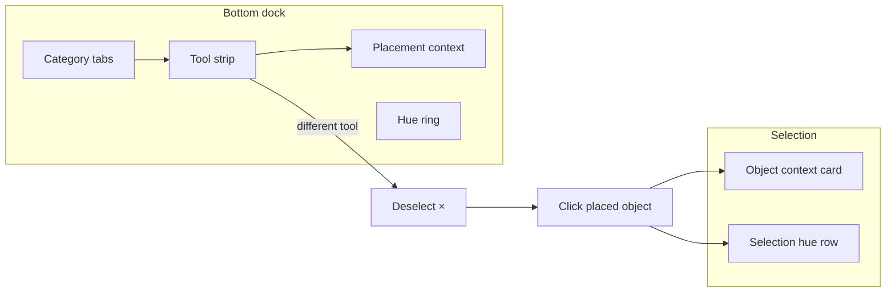

# Build menu (bottom dock)

Reference for the **in-game build palette** shown along the bottom of the screen when **Build** is on (objects or room edit). Use the names below when describing UI changes so they map cleanly to code and CSS.

**Primary implementation:** [`client/src/ui/hud.ts`](../client/src/ui/hud.ts) (dock DOM, tool strip, placement context) and [`client/src/style.css`](../client/src/style.css) (`.hud-build-bottom-dock*`).

**Selection / edit wiring:** [`client/src/main.ts`](../client/src/main.ts) (`editingTile`, `game.setObstacleSelectHandler`, `hud.showObjectEditPanel`).

---

## When the menu appears

| Mode | How to enter | Dock behavior |
|------|----------------|---------------|
| **Walk** | Build tab off | Dock hidden |
| **Build → Objects** | Build on, scope **Objects** | Full dock: category tabs, tool strip, placement context |
| **Build → Room** | Build on, scope **Room** | **Floor** / **Room settings** tabs; Floor tool strip + **floor tile hue ring** in `build-dock-context`; **Room settings** tab shows sky background in `build-dock-context` (swatch + popover wheel) |

Toggle: **Build** tab on the mode strip (`#hud-mode-tab-build`). Scope: **Objects / Room** (`.hud-build-bottom-dock__edit-kind-select` on desktop; on coarse-pointer mobile, `#hud-build-edit-kind-trigger` opens a fixed overlay list `#hud-build-edit-kind-popover` instead of the native select sheet).

**Scope reset:** Closing build (dock **×**, or Build toggle off) or **opening build** again resets to **Objects** and the **Floor** room tab when the room allows both object and room editing (`resetBuildEditScopeToObjects` in `hud.ts`).

---

## Anatomy (top → bottom)

```
┌─ .hud-build-bottom-dock ─────────────────────────────────────────────┐
│ ┌─ .hud-build-bottom-dock__panel ──────────────────────────────────┐ │
│ │ ┌─ .hud-build-bottom-dock__tabs ───────────────────────────────┐ │ │
│ │ │ TERRAIN | PROPS | BUILDINGS    [Objects ▼]                   │ │ │
│ │ └──────────────────────────────────────────────────────────────┘ │ │
│ │ ┌─ .hud-build-bottom-dock__row--picker ────────────────────────┐ │ │
│ │ │ ┌─ tool strip ─────────┐ ┌─ placement context ─────────────┐ │ │ │
│ │ │ │ .hud-build-bottom-   │ │ .hud-build-bottom-dock__context│ │ │ │
│ │ │ │ dock__tools          │ │  ├─ context-mods (sliders…)    │ │ │ │
│ │ │ │  terrain shape cards │ │  └─ context-color (hue ring,   │ │ │ │
│ │ │ │  or building cards   │ │     Selected preview + [×])     │ │ │ │
│ │ │ └──────────────────────┘ └─────────────────────────────────┘ │ │ │
│ │ └──────────────────────────────────────────────────────────────┘ │ │
│ └──────────────────────────────────────────────────────────────────┘ │
└────────────────────────────────────────────────────────────────────┘
```

Floating **above** the dock (not inside the panel): **selection context card** and **Advanced** popover — see [Selection satellites](#selection-satellites).

---

## Component reference

Use **Reference ID** in feedback (e.g. “increase `build-dock-context-mods` scroll area”).

### Shell & layout

| Reference ID | CSS class / element | Role |
|--------------|---------------------|------|
| `build-dock` | `.hud-build-bottom-dock` | Root; `position: absolute` bottom band; sets `--hud-build-dock-height` for chat inset |
| `build-dock-panel` | `.hud-build-bottom-dock__panel` | Cream card; `max-height: var(--hud-build-dock-panel-max-height)` |
| `build-dock-panel-selection` | `.hud-build-bottom-dock__panel--selection` | Modifier while a map object is selected |
| `build-dock-deselect` | `.hud-build-bottom-dock__deselect` | White circle **×** on the **Selected** GL preview (top-right of thumbnail); clears selection (`onObjectSelectionDismiss`) |
| `build-dock-tabs` | `.hud-build-bottom-dock__tabs` | Tab row + edit-scope select |
| `build-dock-category-tabs` | `.hud-build-bottom-dock__category-tabs` | **Terrain / Props / Buildings** |
| `build-dock-edit-scope` | `.hud-build-bottom-dock__edit-scope` | **Objects / Room** picker; **rotate** (ramps or plain **cube Y** via ↺ ↻ / **R**; **Rot X/Y/Z** steppers in context column) and **delete** (`nq-cross`, selected object) beside it |
| `build-dock-selection-delete` | `.hud-build-bottom-dock__rotate--delete` | Deletes the selected placed object (same as **D** on desktop) |
| `build-dock-picker-row` | `.hud-build-bottom-dock__row--picker` | Tool strip + context grid |
| `build-dock-max-height` | `--hud-build-dock-panel-max-height` | CSS variable on `.hud` (default `min(40vh, 164px)`) |

### Category tabs → tools

| Tab label | `BuildDockCategoryId` | Tools in strip |
|-----------|----------------------|----------------|
| **Terrain** | `terrain` | Cube + shape variants (see below) |
| **Props** | `props` | Signpost |
| **Buildings** | `buildings` | Teleporter, Gate, Billboard (billboard may require admin) |

Constants: `BUILD_DOCK_CATEGORY_ORDER`, `BUILD_DOCK_TOOLS` in `hud.ts`.

### Tool strip (placement list)

| Reference ID | CSS class | Role |
|--------------|-----------|------|
| `build-dock-tools` | `.hud-build-bottom-dock__tools` | Horizontal scroller of placement cards |
| `build-dock-tool-card` | `.hud-build-bottom-dock__tool-card` | One placement tool (Props/Buildings) |
| `build-dock-tool-card-active` | `.hud-build-bottom-dock__tool-card--active` | Current tool |
| `build-dock-terrain-shape-card` | `.hud-build-bottom-dock__terrain-shape-card` | Terrain tab: Cube, Hex, Pyramid, Sphere, Ramp |
| `build-dock-terrain-preview-host` | `.hud-build-bottom-dock__terrain-preview-host` | 3D preview slot when only “block” tool (legacy path; terrain uses shape cards) |

**Tool identity:** `data-tool` on building cards (`block` \| `signpost` \| `teleporter` \| `gate` \| `billboard`); `data-terrain-shape` on terrain cards.

**Hidden select (source of truth):** `#tile-inspector-tool` inside `#tile-inspector-placement` — dock cards sync this and fire `change` → `activateBuildTool()`.

### Placement context (right column)

| Reference ID | CSS class / element | Role |
|--------------|---------------------|------|
| `build-dock-context` | `.hud-build-bottom-dock__context` | White sub-panel beside tool strip |
| `build-dock-context-grid` | `.hud-build-bottom-dock__context-grid` | Mods column + color column |
| `build-dock-context-mods` | `.hud-build-bottom-dock__context-mods` | Placement controls (height, **hex thickness**, **sphere size**, pyramid base, gate direction, billboard view…); **Room settings** (`.hud-build-bottom-dock__room-settings`, Room BG swatch + hue wheel) when Room scope + **Room settings** tab |
| `build-dock-context-room-settings` | `.hud-build-bottom-dock__context--room-settings` | Modifier on context panel: room BG only, color column hidden |
| `build-dock-context-floor` | `.hud-build-bottom-dock__context--floor` | Modifier on context panel: **Floor** tab — hue ring only (mods column hidden) |
| `build-dock-context-color` | `.hud-build-bottom-dock__context-color` | Hue ring + hue dock stack |
| `build-dock-place-label` | `#hud-build-dock-place` | “Place: Cube/Hex/Pyramid…” (terrain shape) or tool name / “Edit: Room” |
| `build-dock-advanced-link` | `#hud-build-dock-advanced` | “More options…” → placement Advanced popover |
| `build-dock-billboard-view` | `.hud-build-bottom-dock__context-view` | Left / Mid / Right facing (billboard tool) |

**Placement inspector root:** `#tile-inspector-placement` (`.tile-inspector`) — reparented into `build-dock-context-mods`. Block params live in `.tile-inspector__section--dock-params` (`data-build-dock-param` on each row; visibility via [`buildDockContextParams.ts`](../client/src/ui/buildDockContextParams.ts)):

- Height: `#tile-inspector-height` (`data-build-dock-param="height"`)
- Thickness (hex): `#tile-inspector-hex-width-row` (`data-build-dock-param="hex-width"`, hex shape only)
- Size (sphere): `#tile-inspector-sphere-size-row` (`data-build-dock-param="sphere-size"`, sphere shape only)
- Base (pyramid): `#tile-inspector-pyramid-base-row` / `#tile-inspector-pyramid-base` (`data-build-dock-param="pyramid-base"`, pyramid shape only)
- Gate opening: `#build-block-bar-gate` (gate tool)
- Teleporter placeholder: `#build-block-bar-teleporter`

### Color (hue ring)

| Reference ID | Module / class | Role |
|--------------|----------------|------|
| `palette-hue-ring` | `createPaletteHueRing()` in [`paletteHueRing.ts`](../client/src/ui/paletteHueRing.ts) | Shared circular hue control; **center click** opens custom `#RRGGBB` popover ([`paletteHueHexPopover.ts`](../client/src/ui/paletteHueHexPopover.ts)) |
| `build-dock-placement-hue-row` | `.hud-mode-sidebar__shape-color-row--placement` | Ring while **placing** next object |
| `build-dock-floor-hue-row` | `.hud-mode-sidebar__shape-color-row--floor` | Ring on **Floor** tab (Room scope); tints **hover preview**; **left-click** places new tiles or **recolors** existing core/extra floor (`colorRgb` on `placeExtraFloor`), including tiles with blocks on top |
| `build-dock-selection-hue-row` | `.hud-mode-sidebar__shape-color-row--selection` | Ring while **editing** selected tile |
| `hue-dock` | `.hud-mode-sidebar__hue-dock` | Stack under color column (room sky, guest entry, selection ring) |

Placement vs selection: only one hue row visible; see `syncHueDockVisibility()` in `hud.ts`.

### Placement Advanced popover

| Reference ID | Element | Role |
|--------------|---------|------|
| `build-bar-advanced` | `#build-block-bar-advanced` | Shape picker, ramp rotation, experimental claim (color via hue ring in dock context) |
| `build-bar` | `.build-block-bar` | Hidden host for inspector markup (off-dock); drives shared state |

---

## Selection satellites

When the player selects a placed object on the map, the dock stays visible for **changing placement tool**, but extra UI appears:

| Reference ID | Element | Role |
|--------------|---------|------|
| `object-context-card` | `#build-object-panel-context` (`.build-object-panel-context`) | Floating card: lock, gate ACL, teleporter form, billboard actions; **Height / Base** for blocks are in `build-dock-context-mods` |
| `object-advanced` | `#build-object-panel-advanced` | Shape / collision / lock for selected blocks |
| `object-panel-rail` | `.build-object-panel--rail` | Hidden anchor in sidebar mount (layout probe) |
| `tile-inspector-selection` | `#tile-inspector-selection` | Selection-only inspector fragment |

**Dismiss selection:**

- `build-dock-deselect` (dock × button)
- Inline × on context card (`.build-object-panel-context__dismiss`)
- `Escape` (walk/build exit path in `main.ts`)
- Picking a **different placement tool** in the strip (auto-dismiss via `activateBuildTool`)

**API:** `hud.onObjectSelectionDismiss`, `hud.isObjectSelectionActive()`, `hud.hideObjectEditPanel()`.

**Terrain shape cards** while selected update the **selected object’s shape** (same as Advanced shape picker); they do **not** dismiss selection.

---

## State flow (simplified)



---

## TypeScript hooks (for developers)

| Function / handler | File | Purpose |
|--------------------|------|---------|
| `syncBuildBottomDockVisibility()` | `hud.ts` | Show/hide dock in build/floor |
| `syncBuildDockToolStrip()` | `hud.ts` | Rebuild tool cards + thumbnails |
| `syncBuildDockFromToolSelect()` | `hud.ts` | Sync labels, category highlight, strip |
| `syncBuildDockContextParams()` | `hud.ts` | Show/hide dock param rows; sync height/base when selection or placement changes |
| `buildDockContextParamVisible()` | `buildDockContextParams.ts` | Param row visibility rules (`height`, `pyramid-base`, `hex-width`) |
| `activateBuildTool(tool)` | `hud.ts` | Tool mode flags + dismiss selection if tool changes |
| `syncHueDockVisibility()` | `hud.ts` | Placement vs selection hue rows |
| `showObjectEditPanel(opts)` | `hud.ts` | Open selection UI |
| `onBuildToolSelect` | `main.ts` | Billboard preview sync |
| `onObjectSelectionDismiss` | `main.ts` | Clear `editingTile`, `clearSelectedBlock` |
| `game.setObstacleSelectHandler` | `main.ts` | Map pick → panel |

---

## How to describe improvements

1. **Pick a layer:** shell (`build-dock-panel`), list (`build-dock-tools`), context (`build-dock-context-mods`), color (`palette-hue-ring`), or selection (`object-context-card`).
2. **Name the mode:** placement (nothing selected) vs selection (`build-dock-panel-selection`).
3. **Name the tab/tool:** e.g. “Buildings → Teleporter” = category `buildings`, `data-tool="teleporter"`.
4. **Point at files:** visual/layout → `style.css` + class above; behavior → `hud.ts` function from the table.

**Examples**

- “Add a snap toggle under `build-dock-context-mods` for ramp rotation.”
- “`build-dock-deselect` should sit on the context card instead of the panel.”
- “When `build-dock-panel-selection` is on, keep `build-dock-tools` scrolling but pin the active `build-dock-tool-card-active`.”
- “Raise `--hud-build-dock-panel-max-height` or make `build-dock-context-mods` two-column.”

---

## Related docs

- [build.md](build.md) — world model, authority, placement messages
- [ui-styling.md](ui-styling.md) — global HUD tokens and overlays
- [features-checklist.md](features-checklist.md) — shipped build features
