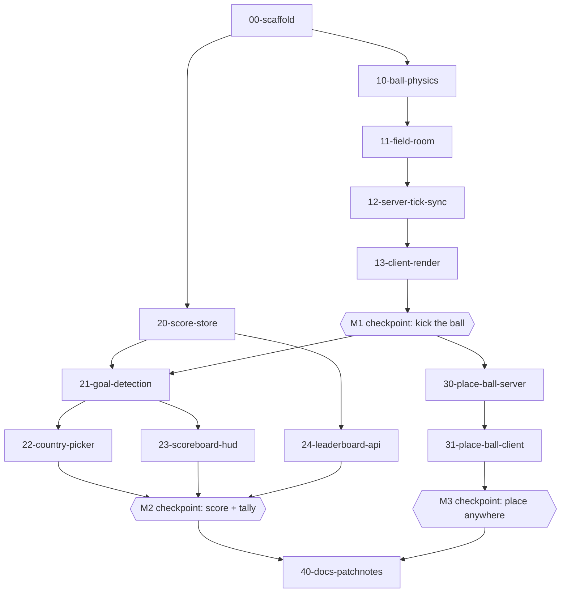

# World Cup soccer — local issues pipeline

A self-contained backlog for the seasonal soccer feature. Each `NN-slug.md` issue
carries YAML frontmatter (`id`, `milestone`, `depends_on`, `status`, `acceptance`,
`verify`) followed by implementation notes. The whole `worldcup/` tree (this backlog
plus `server/src/worldcup/` and `client/src/worldcup/`) is meant to be deleted in one
go when the feature is deprecated.

## How the pipeline runs

Issues are executed in dependency order. Independent issues (no shared files / no
`depends_on`) can be built in parallel by separate agents; dependent issues run in
order. Between issues, run the gates:

- `npm run build` (client + server typecheck/build)
- `npm test -w server` (unit tests for pure logic: ball physics, scoring)

At each milestone boundary there is a **manual in-game checkpoint** — the feature is
left in a testable state for a human to verify before the next milestone starts.

## Status legend

`todo` -> `in_progress` -> `done`. Update an issue's frontmatter `status` as it
moves. The aggregate status also lives in the chat plan's todo list.

## Milestones

- **M0** — scaffolding, feature flag, docs/patchnote stubs (`00`).
- **M1** — kickable ball in the field room, no scoring (`10`–`13`).
- **M2** — goals, country picker, tally, leaderboard API (`20`–`24`).
- **M3** — place a ball in any map (`30`–`31`).
- **M4** — finalize docs + public patch notes (`40`).

## Deprecation

1. `WORLDCUP_ENABLED=0` (server) + `VITE_WORLDCUP_ENABLED=0` (client) disables it.
2. Full removal: delete `worldcup/`, `server/src/worldcup/`, `client/src/worldcup/`,
   then remove the `worldcup`-tagged hook lines (grep `worldcup`). Keep
   `server/data/worldcup-scores.json` as the final archive if desired.
